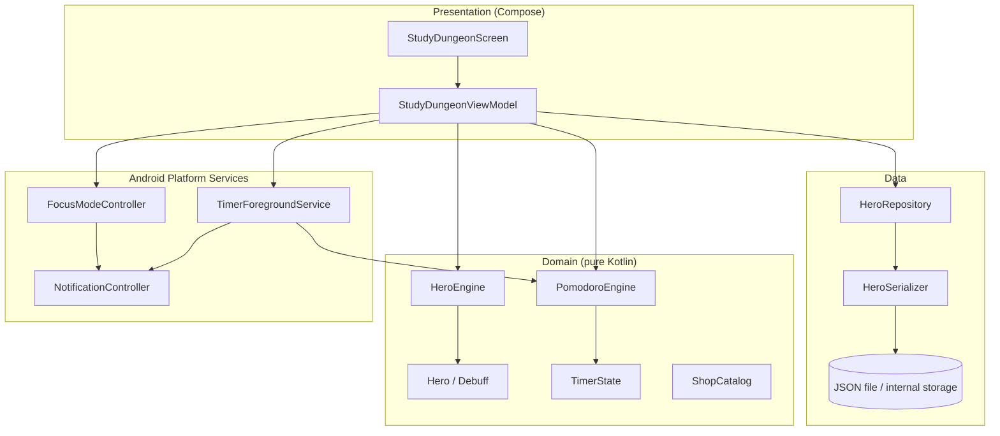
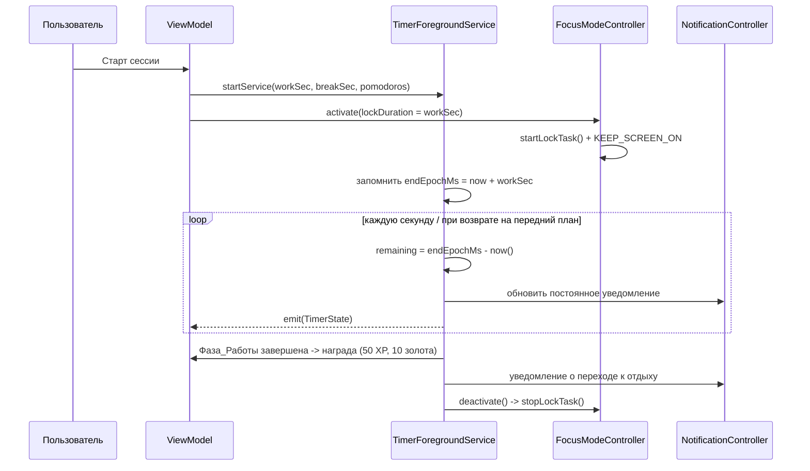

# Design Document

## Overview

Документ описывает технический дизайн нативного Android-приложения **Study Dungeon** — переноса настольного геймифицированного Pomodoro-таймера (Python/tkinter) на мобильную платформу. Дизайн сохраняет паритет игровой механики оригинала (RPG-герой, фазы работы/отдыха, серии помидорок, магазин, локальное сохранение, принудительное удержание фокуса) и адаптирует его под Android: фоновую работу таймера через foreground service, уведомления, локальное хранение прогресса и Android-эквивалент «блокировки экрана» через Screen Pinning / Lock Task Mode.

### Соответствие оригиналу

Исходный код выделяет три предметные подсистемы, которые напрямую переносятся в доменный слой Android-приложения:

| Python-модуль | Назначение | Android-эквивалент |
|---------------|-----------|--------------------|
| `character.py` (`HeroCharacter`, `Debuff`) | Чистая игровая логика героя | `domain/HeroEngine` + `Hero` (immutable data class) |
| `pomodoro.py` (`PomodoroTimer`) | Машина состояний таймера | `domain/PomodoroEngine` + `TimerState` |
| `save_manager.py` | JSON-сериализация/persistence | `data/HeroRepository` + сериализатор |
| `main.py` (UI, focus-lock) | UI и удержание фокуса | `ui/*` (Compose) + `service/*` (foreground service, focus mode) |

### Ключевые технологические решения

- **Язык / UI**: Kotlin + Jetpack Compose. Compose даёт декларативный UI, удобный для сворачиваемых секций и реактивного отображения состояния героя/таймера.
- **Архитектура**: MVVM + однонаправленный поток данных (UDF). Доменная логика — чистые функции без побочных эффектов (для тестируемости и переносимости из Python).
- **Persistence**: Jackson/kotlinx.serialization-сериализация в JSON-файл во внутреннем хранилище приложения (паритет с `character_save.json`). Это сохраняет формат и упрощает миграцию данных, при этом доступен Room как альтернатива (см. Architecture).
- **Фоновая работа**: Foreground Service (тип `dataSync`/специальный) + расчёт времени по «настенным» часам (wall-clock), а не по тикам, чтобы отсчёт оставался достоверным при выключенном экране.
- **Режим фокуса**: Lock Task Mode (`startLockTask()`) — пользовательский Screen Pinning либо Device Owner. Удержание экрана включённым через `FLAG_KEEP_SCREEN_ON`/wake lock.

### Обоснование решения по persistence

Оригинал хранит состояние в одном JSON-файле. Поскольку у приложения единственный профиль героя (один сериализуемый объект, не коллекция запросов), полноценная реляционная БД (Room) избыточна. Сериализация в JSON во внутреннем хранилище сохраняет паритет формата и проста для round-trip-тестирования. Room указан как опциональная альтернатива, если в будущем появятся история сессий или несколько профилей.

## Architecture

Приложение построено по слоистой архитектуре с однонаправленным потоком данных. Доменный слой не зависит от Android SDK и содержит всю игровую логику в виде чистых функций.



### Поток данных таймера и фонового сервиса



### Принцип расчёта времени (достоверность фона)

Оригинальный `PomodoroTimer` уменьшает счётчик в потоке через `time.sleep(1)`. На Android поток может быть приостановлен системой (Doze, выключенный экран). Поэтому `PomodoroEngine` хранит **момент окончания фазы** (`phaseEndEpochMs`), а оставшееся время вычисляется как `phaseEndEpochMs - System.currentTimeMillis()`. Тики раз в секунду нужны только для обновления UI/уведомления, но не являются источником истины. Это обеспечивает выполнение Requirement 11.2 (согласованность времени при возврате на передний план).

## Components and Interfaces

### Domain: Hero и HeroEngine

`HeroEngine` — это перенос чистой логики `character.py`. Все операции возвращают **новый** `Hero` (immutable), что упрощает тестирование и исключает скрытые мутации.

```kotlin
enum class Debuff(val value: String) {
    NONE("none"), TIRED("tired"), DISTRACTED("distracted"), WEAK("weak");
    companion object { fun fromValue(v: String): Debuff = entries.firstOrNull { it.value == v } ?: NONE }
}

data class Hero(
    val name: String = "Искатель Знаний",
    val level: Int = 1,
    val currentXp: Int = 0,
    val xpToNext: Int = 100,
    val currentHp: Int = 100,
    val maxHp: Int = 100,
    val gold: Int = 50,
    val debuff: Debuff = Debuff.NONE,
    val inventory: List<String> = emptyList()
)

object HeroEngine {
    fun addReward(hero: Hero, xpReward: Int, goldReward: Int): Hero  // R2.1, R2.2, R2.3
    fun levelUp(hero: Hero): Hero                                    // R2.3
    fun takeDamage(hero: Hero, damage: Int): Hero                    // R3.1, R3.2, R3.3
    fun heal(hero: Hero, amount: Int): Hero                          // R4.1, R4.2
    fun buyItem(hero: Hero, itemName: String, cost: Int): BuyResult  // R5.1, R5.2
    fun forceQuitPenalty(hero: Hero): Hero                           // R9.3
}

data class BuyResult(val success: Boolean, val hero: Hero)
```

Поведение методов точно повторяет оригинал:
- `addReward`: `currentXp += xp; gold += gold`, затем `while (currentXp >= xpToNext) levelUp()`.
- `levelUp`: `level += 1; currentXp -= xpToNext; xpToNext = (xpToNext * 1.5).toInt(); maxHp += 20; currentHp = maxHp; debuff = NONE`.
- `takeDamage`: `currentHp -= damage; if (currentHp < 0) currentHp = 0; if (currentHp <= 30) debuff = DISTRACTED`.
- `heal`: `currentHp = min(currentHp + amount, maxHp); if (currentHp > 50) debuff = NONE`.
- `buyItem`: при `gold >= cost` — списать золото, добавить предмет, success=true; иначе без изменений, success=false.
- `forceQuitPenalty` (новое, R9.3): `currentHp -= 50` (с ограничением >=0), `currentXp = max(0, currentXp - 30)`, `debuff = WEAK`.

### Domain: ShopCatalog

```kotlin
data class ShopItem(val id: String, val displayName: String, val cost: Int)

object ShopCatalog {
    val items: List<ShopItem> = listOf(
        ShopItem("potion", "Малое зелье", 20),   // R5.3 -> heal(30)
        ShopItem("scroll", "Свиток мудрости", 50) // R5.4 -> addReward(50, 0)
    )
    fun purchase(hero: Hero, item: ShopItem): BuyResult  // списание + эффект предмета
}
```

`purchase` применяет `buyItem`, и только при `success == true` применяет эффект: зелье — `heal(hero, 30)`, свиток — `addReward(hero, 50, 0)`. Все элементы каталога имеют `cost > 0` (R5.5).

### Domain: PomodoroEngine и TimerState

```kotlin
enum class Phase { WORK, BREAK }
enum class RunState { STOPPED, RUNNING, PAUSED }

data class TimerState(
    val phase: Phase = Phase.WORK,
    val runState: RunState = RunState.STOPPED,
    val workDurationSec: Int,
    val breakDurationSec: Int,
    val secondsLeft: Int,
    val phaseEndEpochMs: Long? = null,   // источник истины при RUNNING
    val completedPomodoros: Int = 0,
    val totalPomodoros: Int = 1
)

object PomodoroEngine {
    fun applySettings(state: TimerState, workSec: Int, breakSec: Int, total: Int): TimerState // R6.5
    fun start(state: TimerState, nowMs: Long): TimerState        // R7.1
    fun pause(state: TimerState, nowMs: Long): TimerState        // R7.5
    fun fail(state: TimerState): TimerState                      // R9.1
    fun tick(state: TimerState, nowMs: Long): TickResult         // R7.2-7.4, R8.1
    fun formatTime(secondsLeft: Int): String                    // R7.2 "MM:SS"
}

sealed interface TickResult {
    data class Continue(val state: TimerState) : TickResult
    data class WorkCompleted(val state: TimerState) : TickResult  // -> награда + переход к отдыху
    data class BreakCompleted(val state: TimerState) : TickResult // -> переход к работе
    data class SeriesCompleted(val state: TimerState) : TickResult
}
```

`tick` вычисляет `secondsLeft = max(0, (phaseEndEpochMs - nowMs)/1000)`. При достижении нуля в фазе WORK увеличивает `completedPomodoros`, переключает на BREAK; если `completedPomodoros >= totalPomodoros` — возвращает `SeriesCompleted`. При нуле в BREAK переключает на WORK. Логика переключения фаз повторяет `_switch_phase` оригинала, но без рекурсивного потока.

### Data: HeroRepository и сериализация

```kotlin
interface HeroRepository {
    suspend fun load(): Hero          // R10.2, R10.3
    suspend fun save(hero: Hero)      // R10.1
}

object HeroSerializer {
    fun toJson(hero: Hero): String    // паритет с to_dict()
    fun fromJson(json: String): Hero  // паритет с from_dict(), отказоустойчивость -> default
}
```

`FileHeroRepository` пишет JSON во внутреннее хранилище (`context.filesDir/character_save.json`). При отсутствии или повреждении файла `load()` возвращает `Hero()` со значениями по умолчанию (R10.3). Запись атомарна (запись во временный файл + rename), чтобы исключить частично записанное состояние.

### Platform: TimerForegroundService

Foreground service владеет «тикером» (корутина/`Handler`), который раз в секунду вызывает `PomodoroEngine.tick`, обновляет постоянное уведомление и публикует `TimerState` через `StateFlow`, наблюдаемый ViewModel. Сервис продолжает работу при свёрнутом приложении и выключенном экране (R11.1, R11.3). При смене фаз и завершении серии отправляет уведомления (R12).

### Platform: FocusModeController

```kotlin
class FocusModeController(activity: ComponentActivity) {
    fun activate(lockDurationSec: Int)   // R13.1, R13.2, R13.5
    fun deactivate()                      // R13.8, R13.9
    fun isLockTaskActive(): Boolean
    fun onLockTaskExitDetected(callback: () -> Unit) // R9.4, R13.10
}
```

`activate` вызывает `startLockTask()` (Screen Pinning / Lock Task), устанавливает флаг `KEEP_SCREEN_ON`, и помечает длительность блокировки равной `workSec`. Если закрепление недоступно — приложение запрашивает у пользователя ручное включение Screen Pinning и показывает инструкцию (R13.7). Принудительный выход из закрепления до конца фазы детектируется и трактуется как провал сессии (R9.4, R13.10).

### Platform: NotificationController

Управляет каналами уведомлений, постоянным уведомлением таймера и событийными уведомлениями (переход к отдыху/работе, завершение серии, напоминание о возврате). При отсутствии разрешения `POST_NOTIFICATIONS` запрашивает его при первой отправке (R12.4).

### Presentation: StudyDungeonViewModel

ViewModel связывает домен, репозиторий и платформенные сервисы, экспонирует `UiState` (Hero + TimerState + видимость секций) во Compose. Управляет: применением настроек (с отклонением во время работы — R6.4), стартом/паузой/провалом, покупками, сохранением после каждого изменения состояния героя (R10.1) и скрытием секций в режиме фокуса (R13.6).

## Data Models

### Сохраняемая модель (JSON, паритет с `to_dict`)

```json
{
  "name": "Искатель Знаний",
  "level": 1,
  "current_xp": 0,
  "xp_to_next": 100,
  "current_hp": 100,
  "max_hp": 100,
  "gold": 50,
  "debuff": "none",
  "inventory": []
}
```

Поля и их типы соответствуют оригиналу, что обеспечивает совместимость формата и корректный round-trip (R10.4).

### Доменные модели

- `Hero` — неизменяемое состояние героя (см. выше).
- `Debuff` — перечисление {NONE, TIRED, DISTRACTED, WEAK} (R1.2).
- `TimerState` — состояние таймера и прогресса серии.
- `ShopItem` / `BuyResult` — каталог магазина и результат покупки.
- `UiState` — агрегат для Compose: `Hero`, `TimerState`, флаги видимости секций, флаг активного режима фокуса.

### Начальные значения (R1.1)

`name="Искатель Знаний"`, `level=1`, `currentXp=0`, `xpToNext=100`, `currentHp=100`, `maxHp=100`, `gold=50`, `debuff=NONE`, `inventory=[]`.

## Correctness Properties

*Свойство (property) — это характеристика или поведение, которое должно быть истинным для всех допустимых исполнений системы. По сути это формальное утверждение о том, что система должна делать. Свойства служат мостом между человекочитаемой спецификацией и машинно-проверяемыми гарантиями корректности.*

Доменная логика (`HeroEngine`, `PomodoroEngine`, `HeroSerializer`, логика видимости UI-секций) — это чистые функции с большим пространством входов, поэтому она проверяется свойствами (property-based testing). Платформенные эффекты (Lock Task, foreground service, уведомления, разрешения) проверяются integration/smoke-тестами и в свойства не выносятся.

### Property 1: Допустимость дебаффа сохраняется

*Для любого* Героя и любой конечной последовательности операций (начисление награды, урон, лечение, покупка, штраф за принудительный выход) итоговый Дебафф Героя всегда принадлежит множеству {NONE, TIRED, DISTRACTED, WEAK}.

**Validates: Requirements 1.2**

### Property 2: Начисление награды увеличивает золото и эффективный опыт

*Для любого* Героя и любой неотрицательной награды (xpReward, goldReward) после `addReward` Золото увеличивается ровно на goldReward, а суммарный накопленный опыт (с учётом перешедших в уровни очков) увеличивается ровно на xpReward.

**Validates: Requirements 2.1**

### Property 3: После начисления награды опыт меньше порога следующего уровня

*Для любого* Героя и любой неотрицательной награды после `addReward` выполняется `currentXp < xpToNext`.

**Validates: Requirements 2.2**

### Property 4: Повышение уровня применяет корректные преобразования

*Для любого* Героя, у которого `currentXp >= xpToNext`, после одного повышения уровня: уровень увеличивается на 1, новый `xpToNext` равен целой части произведения прежнего значения на 1.5, максимальное Здоровье увеличивается на 20, текущее Здоровье становится равным максимальному, а Дебафф устанавливается в NONE.

**Validates: Requirements 2.3**

### Property 5: Урон уменьшает Здоровье с нижней границей 0

*Для любого* Героя и любой неотрицательной величины урона после `takeDamage` текущее Здоровье равно `max(0, currentHp - damage)` (точное уменьшение при отсутствии переполнения вниз и фиксация на 0 в противном случае).

**Validates: Requirements 3.1, 3.2**

### Property 6: Низкое Здоровье после урона даёт дебафф DISTRACTED

*Для любого* Героя и любой величины урона: если итоговое текущее Здоровье меньше или равно 30, то Дебафф становится DISTRACTED.

**Validates: Requirements 3.3**

### Property 7: Лечение ограничено максимальным Здоровьем

*Для любого* Героя и любой неотрицательной величины лечения после `heal` текущее Здоровье равно `min(currentHp + amount, maxHp)` и не превышает максимального Здоровья.

**Validates: Requirements 4.1**

### Property 8: Высокое Здоровье после лечения снимает дебафф

*Для любого* Героя и любой величины лечения: если итоговое текущее Здоровье больше 50, то Дебафф становится NONE.

**Validates: Requirements 4.2**

### Property 9: Покупка зависит от достаточности золота

*Для любого* Героя и любого предмета со стоимостью cost: если Золото >= cost, покупка успешна — Золото уменьшается ровно на cost, предмет добавляется в Инвентарь, результат успешен; если Золото < cost, Золото и Инвентарь не изменяются, результат неуспешен.

**Validates: Requirements 5.1, 5.2**

### Property 10: Успешная покупка зелья лечит на 30

*Для любого* Героя с Золотом не менее 20 покупка "Малого зелья" уменьшает Золото на 20 и устанавливает текущее Здоровье равным `min(oldHp + 30, maxHp)`.

**Validates: Requirements 5.3**

### Property 11: Успешная покупка свитка начисляет 50 опыта

*Для любого* Героя с Золотом не менее 50 покупка "Свитка мудрости" уменьшает Золото на 50, а эффект на опыт и уровень эквивалентен `addReward(50, 0)` (включая возможные повышения уровня).

**Validates: Requirements 5.4**

### Property 12: Настройки отклоняются при работающем таймере

*Для любого* состояния Таймера в состоянии выполнения вызов применения настроек не изменяет длительности Фазы_Работы и Фазы_Отдыха и сигнализирует об отклонении.

**Validates: Requirements 6.4**

### Property 13: Применение настроек устанавливает длительности и оставшееся время

*Для любого* состояния Таймера не в состоянии выполнения и любых валидных длительностей (workSec, breakSec) после применения настроек длительность Фазы_Работы и Фазы_Отдыха равны заданным, оставшееся время равно workSec, а фаза — WORK.

**Validates: Requirements 6.5**

### Property 14: Длительность блокировки равна длительности фазы работы

*Для любого* значения длительности Фазы_Работы при старте Таймера активируемый Режим_Фокуса устанавливает Длительность_Блокировки, равную длительности Фазы_Работы текущей сессии.

**Validates: Requirements 6.6, 13.1**

### Property 15: Старт переводит таймер в выполнение

*Для любого* состояния Таймера в состоянии остановки после старта состояние становится «выполнение», а момент окончания фазы равен текущему времени плюс оставшееся время в миллисекундах.

**Validates: Requirements 7.1**

### Property 16: Round-trip форматирования времени

*Для любого* значения оставшихся секунд в диапазоне отображения форматирование в строку "ММ:СС" и обратный разбор дают исходное число секунд.

**Validates: Requirements 7.2**

### Property 17: Завершение фазы работы фиксирует помидорку и переходит к отдыху

*Для любого* состояния Таймера в выполнении и Фазе_Работы при достижении нулём оставшегося времени число завершённых Помидорок увеличивается на 1, фаза становится Фазой_Отдыха, а оставшееся время равно длительности Фазы_Отдыха.

**Validates: Requirements 7.3, 8.1**

### Property 18: Завершение фазы отдыха переходит к работе

*Для любого* состояния Таймера в выполнении и Фазе_Отдыха при достижении нулём оставшегося времени фаза становится Фазой_Работы, а оставшееся время равно длительности Фазы_Работы.

**Validates: Requirements 7.4**

### Property 19: Пауза сохраняет оставшееся время

*Для любого* состояния Таймера в выполнении после паузы состояние становится «пауза», а сохранённое оставшееся время равно оставшемуся времени на момент паузы.

**Validates: Requirements 7.5**

### Property 20: Успех фазы работы начисляет награду атомарно

*Для любого* Героя успешное завершение Фазы_Работы применяет эффект, эквивалентный `addReward(50, 10)` (Золото +10 и эффективный опыт +50), причём обе части награды применяются вместе либо не применяются вовсе (атомарность).

**Validates: Requirements 7.6**

### Property 21: Достижение цели серии фиксирует завершение серии

*Для любого* состояния Таймера, в котором число завершённых Помидорок достигает общего числа Помидорок Серии, результат тика фиксирует завершение Серии.

**Validates: Requirements 8.3**

### Property 22: Новая серия обнуляет счётчик помидорок

*Для любого* завершённого состояния серии запуск новой Серии устанавливает число завершённых Помидорок равным 0.

**Validates: Requirements 8.4**

### Property 23: Сдача останавливает таймер и сбрасывает в фазу работы

*Для любого* состояния Таймера после сдачи состояние становится «остановлено», фаза — Фаза_Работы, а оставшееся время равно длительности Фазы_Работы.

**Validates: Requirements 9.1**

### Property 24: Провал сессии наносит 15 урона

*Для любого* Героя провал сессии или фиксация отвлечения наносит урон 15 единиц Здоровья (с применением правил нижней границы и дебаффа из `takeDamage`).

**Validates: Requirements 9.2**

### Property 25: Принудительное закрытие применяет фиксированные штрафы

*Для любого* Героя принудительное завершение Приложения во время выполнения Таймера приводит к: текущему Здоровью `max(0, oldHp - 50)`, текущему Опыту `max(0, oldXp - 30)` и Дебаффу WEAK — независимо от итогового значения Здоровья.

**Validates: Requirements 9.3**

### Property 26: Выход из закрепления эквивалентен провалу сессии

*Для любого* Героя принудительный выход из Закрепления_Экрана во время активного Режима_Фокуса до завершения Фазы_Работы применяет штрафы провала сессии, эквивалентные `takeDamage(15)`, и деактивирует Режим_Фокуса.

**Validates: Requirements 9.4, 13.10**

### Property 27: Round-trip сохранения состояния Героя

*Для любого* валидного Героя сериализация в JSON и последующая десериализация дают Героя, эквивалентного исходному по всем полям (имя, уровень, текущий и пороговый опыт, текущее и максимальное Здоровье, Золото, Дебафф, Инвентарь).

**Validates: Requirements 10.4**

### Property 28: Достоверность отсчёта по «настенным» часам

*Для любого* начального оставшегося времени и любого прошедшего интервала dt пересчёт оставшегося времени равен `max(0, начальное_оставшееся - dt)` и не зависит от числа произошедших тиков, свёрнутости Приложения или выключения экрана.

**Validates: Requirements 11.1, 11.2, 13.4**

### Property 29: Скрытие секций в режиме фокуса

*Для любого* состояния Интерфейса, пока Режим_Фокуса активен, секции настроек, магазина и инвентаря невидимы; после деактивации их видимость восстанавливается до состояния до активации.

**Validates: Requirements 13.6**

### Property 30: Идемпотентность пары переключений секции

*Для любого* состояния видимости сворачиваемой секции двойное переключение (свернуть/развернуть) возвращает секцию к исходной видимости.

**Validates: Requirements 14.4**

### Property 31: Индикатор дебаффа отображается тогда и только тогда, когда дебафф активен

*Для любого* Героя индикатор активного Дебаффа видим в Интерфейсе тогда и только тогда, когда Дебафф отличается от NONE.

**Validates: Requirements 14.6**

## Error Handling

### Persistence

- **Повреждённый или отсутствующий файл сохранения**: `HeroSerializer.fromJson` и `FileHeroRepository.load` перехватывают ошибки разбора/ввода-вывода и возвращают `Hero()` со значениями по умолчанию (R10.3). Исключения не пробрасываются в UI.
- **Атомарная запись**: `save` пишет во временный файл и затем атомарно переименовывает его, чтобы прерванная запись не оставила частично записанное состояние. Ошибка записи логируется, но не «роняет» приложение.
- **Независимость уведомления от записи (R8.3)**: завершение Серии отправляет уведомление даже если сохранение факта завершения завершилось ошибкой — отправка уведомления и сохранение выполняются независимо, ошибка одного не отменяет другое.

### Таймер и фоновый сервис

- **Приостановка процесса системой (Doze/выключенный экран)**: источник истины — `phaseEndEpochMs`, поэтому пропущенные тики не искажают отсчёт; при возврате на передний план время пересчитывается (R11.2).
- **Перезапуск сервиса системой**: сервис восстанавливает состояние из сохранённого `phaseEndEpochMs`/настроек; если данные недоступны — переходит в STOPPED без штрафа.

### Режим фокуса и закрепление экрана

- **Закрепление недоступно (нет прав, отключено пользователем)**: приложение не стартует «тихо» сломанным — показывает запрос и инструкцию по включению Screen Pinning (R13.7); таймер не считается запущенным в режиме фокуса, пока пользователь не подтвердит.
- **Принудительный выход из закрепления**: детектируется через колбэк выхода из Lock Task и трактуется как провал сессии со штрафами R9.2 (R9.4/R13.10).

### Разрешения

- **Нет разрешения на уведомления**: при первой попытке отправки приложение запрашивает `POST_NOTIFICATIONS` (R12.4); при отказе таймер продолжает работать, но без уведомлений, и приложение информирует пользователя об ограничении.

### Валидация ввода

- Значения длительностей и числа помидорок вне допустимых диапазонов (R6.1–6.3) клампятся к границам или отклоняются на уровне UI до передачи в `PomodoroEngine`.

## Testing Strategy

Применяется двойной подход: property-based-тесты для универсальной доменной логики и unit/integration/smoke-тесты для конкретных примеров, краевых случаев и платформенных эффектов.

### Property-Based Testing

- **Библиотека**: используется существующая property-библиотека для Kotlin/JVM (например, **kotest property** или **jqwik**). Property-тесты НЕ реализуются с нуля.
- **Покрытие**: каждое из свойств 1–31 раздела Correctness Properties реализуется ОДНИМ property-тестом.
- **Итерации**: минимум 100 итераций на каждый property-тест.
- **Тегирование**: каждый property-тест помечается комментарием со ссылкой на свойство дизайна в формате:
  `// Feature: android-study-dungeon, Property {number}: {property_text}`
- **Генераторы**: генератор `Hero` покрывает краевые случаи (HP около границ 0/30/50, большие значения XP, провоцирующие многократный level-up, пустой/непустой инвентарь, все значения Debuff). Генератор `TimerState` покрывает все комбинации фаз и состояний выполнения и краевые длительности (границы диапазонов R6.1–6.3 — закрывает edge-case-критерии 6.1, 6.2, 6.3, 10.3).

### Unit-тесты (примеры и краевые случаи)

- Начальное состояние Героя по умолчанию (R1.1).
- Прозрачность отображения значений Героя (R1.3).
- Каталог магазина: все предметы имеют cost > 0 (R5.5); отображение названий/стоимости (R5.6).
- Загрузка после сохранения возвращает того же Героя (R10.2).
- Невалидный/пустой JSON и отсутствующий файл -> дефолтный Герой (R10.3, дополняет Property 27).

### UI-тесты (Compose) / snapshot

- Панель характеристик, таймер, элементы управления, инвентарь (R5.7, R14.1–14.3).
- Анимация успеха при завершении помидорки (R14.5).
- Сворачиваемость секций (дополняет Property 30) и индикатор дебаффа (дополняет Property 31).

### Integration-тесты

- Foreground service поддерживает постоянное уведомление с фазой/временем (R11.3).
- Уведомления при смене фаз и завершении серии (R12.1–12.3).
- Lock Task активен в течение Фазы_Работы и снимается при завершении/паузе/провале (R13.2, R13.3, R13.8, R13.9).
- Напоминание о возврате при уходе из приложения во время фокуса (R13.11).
- Сохранение вызывается после каждой мутации состояния Героя (R10.1).

### Smoke-тесты

- Запрос разрешения на уведомления при первой отправке (R12.4).
- Удержание экрана включённым при активном фокусе (R13.5).
- Обработка недоступности закрепления: показ запроса/инструкции (R13.7).
